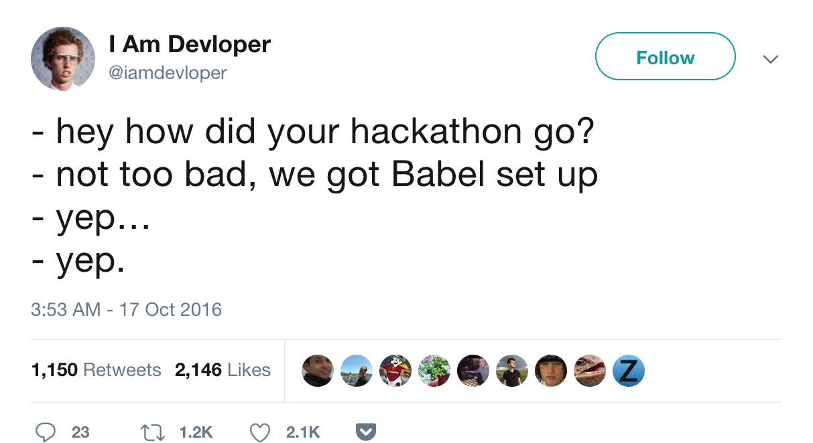
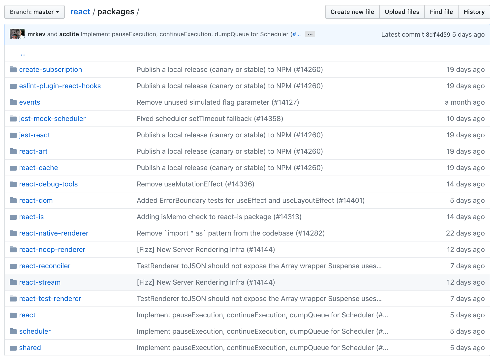

import { CodeSurfer } from 'mdx-deck-code-surfer'

export { dark as theme } from 'mdx-deck/themes'

## Multi-package projects with Lerna

Philip Nuzhnyy // Lisbon.js // Dec 12, 2018
---

---
# How did we get there?
---
 
---
# Problem
- web app choking on background tasks
- increasing inventory
- keep our dev and deployment flow simple
---
# Solution
- split a monolith web app into 2 parts: app and workers
- extract common dependencies and reuse them
- monorepo
---
# Monorepos

```Monorepo is a software development strategy where code for many projects are stored in the same repository```

source: [Wikipedia](https://en.wikipedia.org/wiki/Monorepo)
---
# Monorepos

```As of 2017 this software engineering practice was over a decade old, but had only recently been named```

source: [Wikipedia](https://en.wikipedia.org/wiki/Monorepo)
---
# Monorepos: Pros

- Single lint, build, test and release process.
- Easy to coordinate changes across modules.
- Single place to report issues.
- Easier to setup a development environment.
- Tests across modules are run together which finds bugs that touch multiple modules easier.

source: [Why is Babel a monorepo](https://github.com/babel/babel/blob/master/doc/design/monorepo.md)
---
# Monorepos: Cons

- Codebase looks more intimidating.
- Repo is bigger in size.
- Can't npm install modules directly from GitHub

source: [Why is Babel a monorepo](https://github.com/babel/babel/blob/master/doc/design/monorepo.md)
---

---
# Back to Lerna

```Lerna is a tool that optimizes the workflow around managing multi-package repositories with git and npm.```
---
# Lerna: how it works
---
<CodeSurfer
  code={
    `
    my-lerna-repo/
      - package.json
      - packages/
        - app/
         - package.json
        - workers/
         - package.json
        - shared/
         - package.json
    `
  }
  lang="markdown"
  showNumbers={false}
  dark={false}
  steps={[
    { notes: "repository structurre" },
    { lines: [3], notes: "root package.json" },
    { range: [4, 10], notes: "all your packages live here" },
    { range: [5, 6], notes: "your web app" },
    { range: [7, 8], notes: "your workers" },
    { range: [9, 10], notes: "this code is shared" }
  ]}
/>
---
# Lerna: lerna bootstrap 

- npm install all external dependencies of each package
- Symlink together all Lerna packages that are dependencies of each other
- npm run prepublish in all bootstrapped packages
- npm run prepare in all bootstrapped packages
---
# Lerna bootstrap: example
---
<CodeSurfer
  code={
    `
    {
      "name": "babel-core",
      "dependencies": {
        "babel-generator": "^6.9.0",
        "source-map": "^0.5.0"
      }
    }
    `
  }
  lang="json"
  showNumbers={false}
  dark={false}
  steps={[
    { notes: "package.json for babel-core module" },
    { range: [5, 6], notes: "checks if each dependency is also part of the Lerna repo" },
    { lines: [5], notes: "pulled from packages/babel-generator"},
    { lines: [6], notes: "npm installed (or yarned) like normal"},
    { lines: [5], notes: "packages/babel-core/node_modules/babel-generator symlinks to packages/babel-generator"},
  ]}
/>
---
# Lerna: run

Run an npm script in each package that contains that script

```
lerna run dev
```
---
# Top level package.json for all the chores
---
<CodeSurfer
  code={
    `
    {
      "devDependencies": {
        "babel-cli": "^6.26.0",
        "babel-core": "^6.26.0",
        "babel-jest": "^21.2.0",
        "babel-preset-es2015": "^6.24.1",
        "babel-preset-stage-0": "^6.24.1",
        "eslint": "^4.13.1",
        "eslint-plugin-jest": "^21.3.2",
        "jest": "^21.2.1",
        "lerna": "^2.9.1",
        "regenerator-runtime": "^0.11.0"
      },
      "scripts": {
        "lint": "...",
        "test": "..."
      }
    }
    `
  }
  lang="json"
  showNumbers={false}
  dark={false}
  steps={[
    { notes: "root package.json" },
    { range: [4, 13], notes: "boilerplate" },
    { range: [16, 17], notes: "delegate all the chores here" }
  ]}
/>
---
# CI integration

- push to dev/master trigger staging/prod deployment
- lint and test all the packages using top level test and lint
- deploy the web app (docker image)
- deploy workers (heroku based tiny nodejs services)
---
# How it worked out

- pretty painful at first
- an ongoing effort
- 9 packages at the moment
- all new major features/experiments get a package
---
# Conclusion

- don't do this at home (unless you really need this)
- treat your sub packages as if they were 3rd party npm modules
- move all house keeping to the root `package.json`
---
# Thank you 🙇